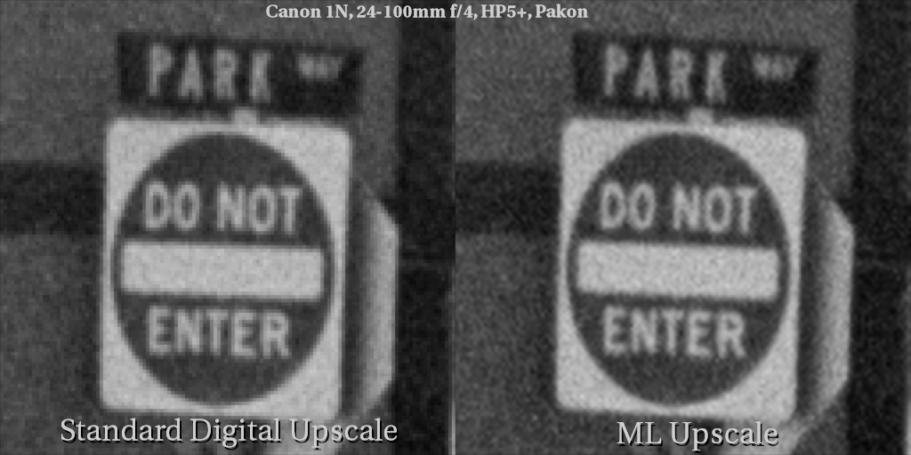
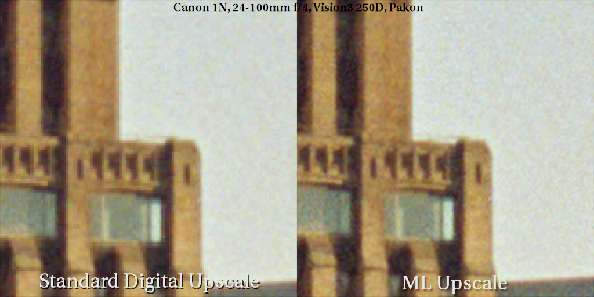
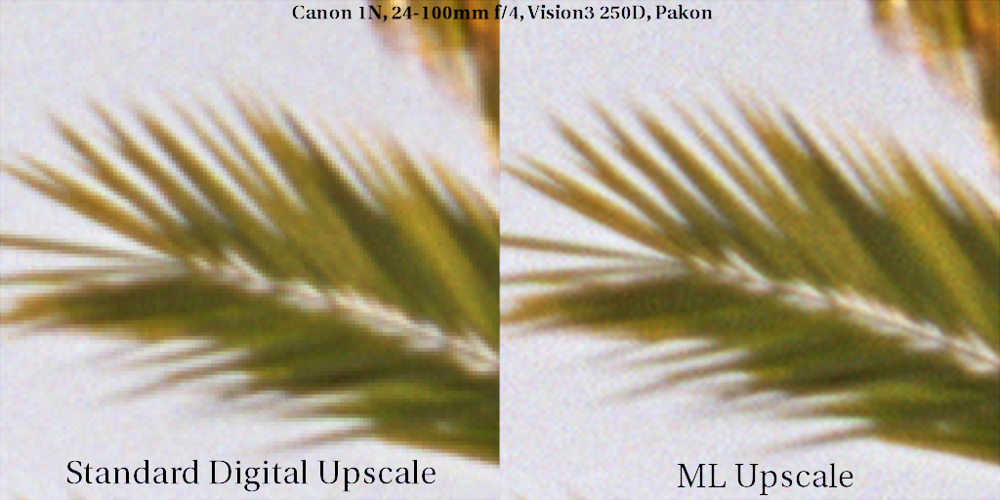
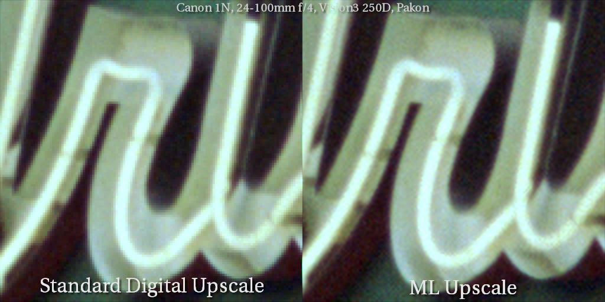

This repository serves as a platform for various methods of machine learning assisted upscaling for photos captured on analog film. The goal in these methods is simply to increase the digital resolution of photos to better suit large scale printing, and not to try and extract more detail/information out of the photos than what is already there.

## SwinIR

I recently took a look into some of the models out there, and I came across the [SwinIR](https://github.com/JingyunLiang/SwinIR) model/paper. I focused mainly on the "ClassicalSR" area of research as the "Real-World" versions all gave the same upscaling results I was used to. I used the [001_classicalSR_DF2K_s64w8_SwinIR-M_x2.pth](https://github.com/JingyunLiang/SwinIR/releases/download/v0.0/001_classicalSR_DF2K_s64w8_SwinIR-M_x2.pth) pre-trained model for upscaling, and was incredibly surprised at how faithful the resulting image was to the original.

### Training

I decided to attempt training the model using the original dataset, but augmented with some of my personal film photos in an attempt to steer the model slightly to behave better on film grain. My procedures were as follows:

- The original training code provided [here](https://github.com/cszn/KAIR)
- The DIV2K 800-image dataset found [here](https://data.vision.ee.ethz.ch/cvl/DIV2K/)
- An additional 300 images from my analog photography over the last few years ranging from B&W, half frame, medium format, etc. across a variety of stocks (Vision3, reversal, Portra, Gold, HP5+)
- Trained on an Nvidia 3090 for 500,000 iterations, with a batch size of 16
- Center cropped all training images to 768x768 to aid in training speed.

### Results

## Using chaiNNer
The process in applying these models to photos these days has never been easier. I've been using [chaiNNer](https://github.com/chaiNNer-org/chaiNNer) to apply all of these models.

There are a couple pre-built scripts that have the node tree set up and ready for upscaling. You simply need to specify the source image, and point it to the location of the model. Depending upon your available GPU memory and the size of your input image, you may need to adjust the "Tile Size" on the "Upscale Image" node.

In my testing using a Pakon scanned image (3000x2000), I'm able to upscale an image on an M1 Pro Macbook Pro in about 4.5-5 minutes, and on a 3090 in about 1 minute.

Both scripts include a Gaussian Blur node after the image upscaling node. It's currently set to 0, but if you find an image is slightly too sharp after processing, using a value of about 0.5 helps soften things out a little but without sacrificing any detail.
